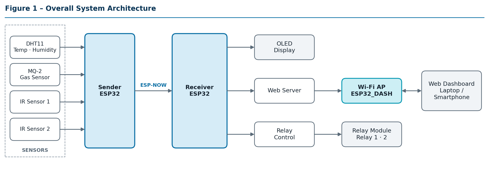
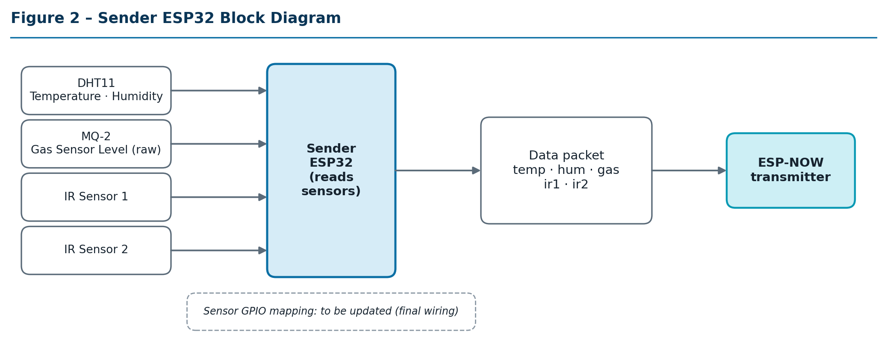
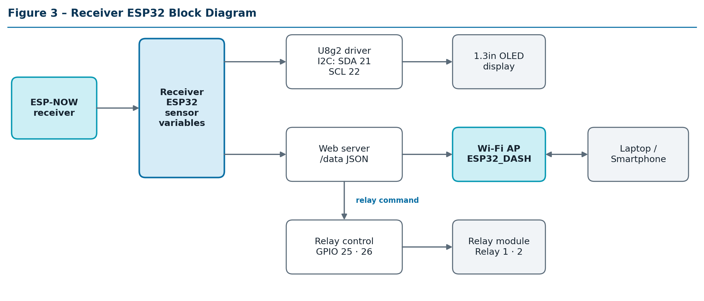
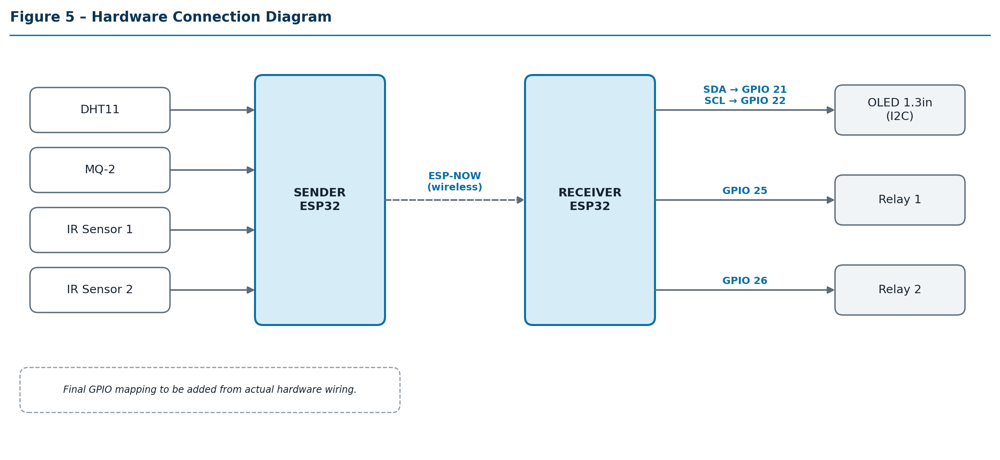
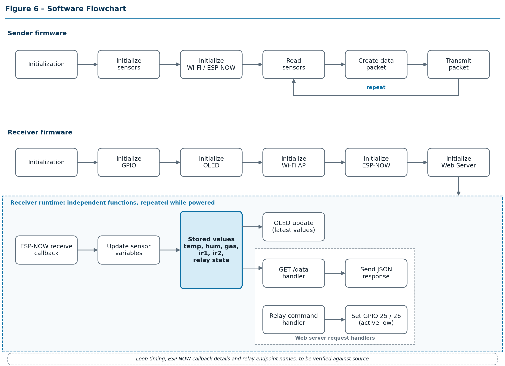
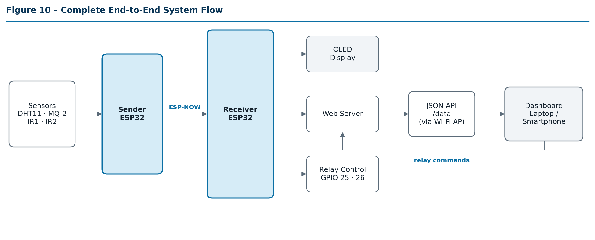
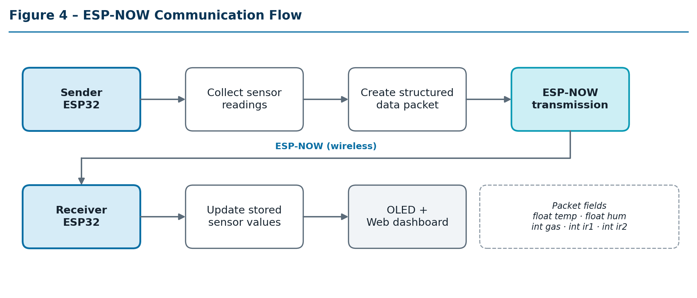
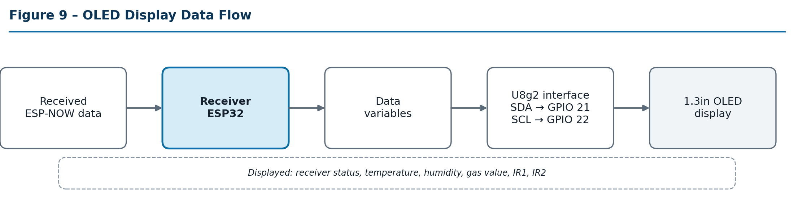
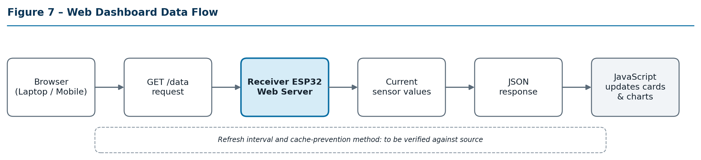
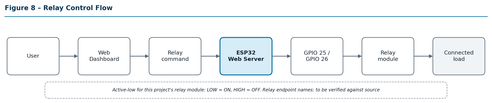

ESP32-SCADA-Wireless-Monitoring-Control




## Project Overview

A two-ESP32 prototype for wireless sensor monitoring and relay control. A **Sender ESP32** (Node 1) reads a DHT11 (temperature, humidity), an MQ-2 gas sensor and two IR sensors, and transmits the readings over **ESP-NOW** to a **Receiver ESP32** (Node 2). The Receiver shows the values on a 1.3" OLED, creates its own Wi-Fi access point, serves a web dashboard with live charts, and drives two relay outputs. No router or internet connection is needed for the sensor link and the dashboard data.

The project demonstrates the basic Industrial IoT chain: field sensing, wireless transfer, and a local interface for monitoring and control.

## Project Status

A student-built **prototype**, not certified for industrial or safety-critical use.

| Category | Status |
|---|---|
| **Implemented** | Sensor acquisition, ESP-NOW link, OLED display, Wi-Fi AP web dashboard with live charts, relay outputs |
| **Tested** | No test results recorded yet |
| **Planned** | Hardware validation (test matrix T01–T15 in the report), Sender pin table, photographs and screenshots |
| **Future** | See [Future Improvements](#future-improvements) |

## Features

- Two-ESP32 architecture (sensor node and monitoring/control node)
- ESP-NOW communication between the boards
- Temperature and humidity monitoring (DHT11)
- Raw gas sensor level monitoring (MQ-2)
- Dual IR sensor monitoring
- OLED display on the Receiver
- Local web dashboard with live Temperature and Gas charts (Chart.js)
- Relay outputs on the Receiver (Relay 1, Relay 2)
- Laptop and smartphone access through the Receiver's Wi-Fi access point

## System Architecture


*Figure 1 – Overall system architecture.*

| Sender | Receiver |
|---|---|
|  |  |

## Hardware Components

| Component | Qty | Role |
|---|---|---|
| ESP32 development board | 2 | Sender (Node 1) and Receiver (Node 2) |
| DHT11 temperature and humidity sensor | 1 | Temperature, humidity |
| MQ-2 gas sensor | 1 | Raw gas sensor level |
| IR sensor | 2 | Object detection/status |
| 1.3" OLED display (I2C) | 1 | Local display on the Receiver |
| Relay module | 1 | Relay 1 and Relay 2 outputs |
| Jumper wires, breadboard, USB power | – | Prototype wiring and power |



*Figure 5 – Hardware connection diagram.*

### Receiver Pin Configuration

| Function | GPIO |
|---|---|
| OLED I2C SDA | 21 |
| OLED I2C SCL | 22 |
| Relay 1 | 25 |
| Relay 2 | 26 |

**Sender pins** (DHT11, MQ-2, IR Sensor 1, IR Sensor 2): to be updated according to final hardware wiring.

## Software and Libraries

| Category | Items |
|---|---|
| Language / framework | C/C++, Arduino framework |
| Libraries | `WiFi.h`, `esp_now.h`, `WebServer.h`, `Wire.h`, `U8g2lib.h`, `esp_wifi.h` |
| Communication | ESP-NOW, Wi-Fi Access Point |
| Web | HTML, CSS, JavaScript, Chart.js (loaded from the jsDelivr CDN) |

## How the System Works

1. The Sender reads the DHT11, MQ-2, IR 1 and IR 2.
2. The readings are placed in a data packet and sent over ESP-NOW.
3. On the Receiver, the ESP-NOW receive callback updates the stored values.
4. The OLED shows the latest stored values.
5. The Receiver's web server serves the dashboard page and answers `GET /data` with the values as JSON. Relay switching is handled separately from the `/data` request.
6. The dashboard page requests `/data` every second and updates its cards and charts.



*Figure 6 – Software flowchart. On the Receiver, the ESP-NOW callback, OLED update, `/data` handler and relay handling are independent functions.*



*Figure 10 – Complete end-to-end system flow.*

## ESP-NOW Communication

ESP-NOW lets ESP32 boards exchange short packets directly, without a Wi-Fi router. The Sender transmits one structured packet:

```c
float temp;   // DHT11 temperature
float hum;    // DHT11 humidity
int   gas;    // raw MQ-2 reading (Gas Sensor Level)
int   ir1;    // IR Sensor 1 value
int   ir2;    // IR Sensor 2 value
```

Both boards must use the same Wi-Fi channel, and the Sender needs the Receiver's MAC address. Range and reliability have not been measured.



*Figure 4 – ESP-NOW communication flow.*

## OLED Display

The Receiver shows receiver status, temperature, humidity, gas value, IR1 and IR2 on a 1.3" OLED using U8g2 over I2C (SDA = GPIO 21, SCL = GPIO 22).



*Figure 9 – OLED display data flow.*

## Web Dashboard

The Receiver creates a Wi-Fi access point:

| Setting | Value |
|---|---|
| SSID | `ESP32_DASH` |
| Password | `12345678` |

The password is defined in firmware. Change it before any real deployment and before making this repository public.

The dashboard page (dark theme) shows:

| Item | Shown as |
|---|---|
| Temperature, Humidity | Cards |
| Gas | Card (raw MQ-2 reading) |
| IR1, IR2 | Cards |
| Temperature | Live line chart (last ~20 readings) |
| Gas | Live line chart (last ~20 readings) |

The page calls `GET /data` once per second. The response contains `temp`, `hum`, `gas`, `ir1`, `ir2` (and `r1`, `r2` relay states where implemented).

> **Charts need internet on the client.** Chart.js is loaded from `cdn.jsdelivr.net`. A phone or laptop connected only to `ESP32_DASH` has no internet access, so the charts will not draw; the value cards still update. Serving Chart.js from the ESP32 itself would remove this dependency.

> **Gas readings.** The MQ-2 value is a raw sensor reading/level used for monitoring, not a calibrated PPM value. Accurate concentration requires proper sensor calibration, load resistance considerations, environmental compensation, and gas-specific calibration.



*Figure 7 – Web dashboard data flow.*

**Screenshots:** real dashboard, OLED and Serial Monitor captures go in [`Screenshots/`](Screenshots) and will be shown here once added.

## Relay Control

Relay 1 is on GPIO 25 and Relay 2 on GPIO 26. For the relay module used in this project the outputs are **active-low**: `LOW` = relay ON, `HIGH` = relay OFF. This does not apply to every relay module. Relay endpoint names: to be documented from the Receiver firmware.



*Figure 8 – Relay control flow.*

> Do not connect hazardous loads to the relays without proper isolation and protection.

## Repository Structure

```
ESP32-Industrial-IoT-Monitoring-Control/
├── README.md
├── .gitattributes
├── Sender_ESP32/
│   └── ESP32_Node1_Sensor2/          Sender sketch (Node 1)
├── Receiver_ESP32/
│   └── ESP32_Node2_Server2/          Receiver sketch (Node 2)
├── Documentation/
│   ├── Project_Report.pdf
│   ├── System_Block_Diagram.png
│   ├── Sender_Block_Diagram.png
│   ├── Receiver_Block_Diagram.png
│   ├── ESP_NOW_Communication_Flow.png
│   ├── Circuit_Diagram.png
│   ├── Software_Flowchart.png
│   ├── Dashboard_Data_Flow.png
│   ├── Relay_Control_Flow.png
│   ├── OLED_Data_Flow.png
│   └── End_to_End_Flow.png
└── Screenshots/                      Serial Monitor, OLED and dashboard captures
```

## Setup

1. Install the Arduino IDE.
2. Install the ESP32 board package.
3. Install the required libraries (U8g2, plus any sensor library used by the Sender sketch).
4. Open `Sender_ESP32/ESP32_Node1_Sensor2` in the Arduino IDE and upload it to the Sender board.
5. Open `Receiver_ESP32/ESP32_Node2_Server2` and upload it to the Receiver board.
6. Make sure the Sender has the Receiver's MAC address and both boards use the same Wi-Fi channel.
7. Connect your laptop or phone to Wi-Fi `ESP32_DASH`.
8. Open the Receiver's IP address in a browser. Read it from the Receiver's **Serial Monitor**.

## Troubleshooting

| Problem | Check |
|---|---|
| ESP-NOW data not received | Wi-Fi channel, receiver MAC address, ESP-NOW initialization, sender/receiver configuration |
| Dashboard shows `--` | `/data` reachable, Receiver receiving packets, web server, browser cache, network connection |
| Charts empty but cards update | No internet on the client, so Chart.js cannot load from the CDN |
| OLED blank | I2C wiring, OLED address, SDA/SCL pins, library configuration |
| Relay not switching | GPIO, active-low logic, relay power, wiring |
| Unstable gas value | MQ-2 warm-up, environment, sensor characteristics, no calibration |

## Limitations

- MQ-2 values are raw sensor levels, not calibrated PPM.
- Dashboard charts depend on the Chart.js CDN, so they need internet access on the client.
- ESP-NOW range and reliability have not been measured.
- Prototype only; not certified for industrial safety applications.
- Relay outputs need proper protection and isolation before use with any hazardous load.
- The Wi-Fi password is set in firmware.
- Sensor accuracy depends on sensor quality, calibration, environment and wiring (the DHT11 is a low-cost sensor).
- Local monitoring and control only; no database or cloud storage.
- No test results have been recorded yet.

## Future Improvements

*Not implemented.* Local Chart.js hosting · responsive dashboard layout · MQTT and cloud dashboard · database and SD-card logging · data export · authentication and HTTPS · sensor calibration and additional sensors · alarm/buzzer and automatic relay rules · Telegram/email alerts · mobile app · OTA updates · watchdog and fault recovery · enclosure, PCB and power supply · emergency shutdown · multiple sensor nodes.

## Documentation

- [Project Report (PDF)](Documentation/Project_Report.pdf)
- Diagrams: [System](Documentation/System_Block_Diagram.png) · [Sender](Documentation/Sender_Block_Diagram.png) · [Receiver](Documentation/Receiver_Block_Diagram.png) · [ESP-NOW](Documentation/ESP_NOW_Communication_Flow.png) · [Circuit](Documentation/Circuit_Diagram.png) · [Software](Documentation/Software_Flowchart.png) · [Dashboard](Documentation/Dashboard_Data_Flow.png) · [Relay](Documentation/Relay_Control_Flow.png) · [OLED](Documentation/OLED_Data_Flow.png) · [End-to-end](Documentation/End_to_End_Flow.png)

## License

No license has been selected yet. Add a `LICENSE` file (for example MIT) before making the repository public.
